<body style="font-family: Arial, sans-serif; line-height: 1.6; margin: 20px;">

  

<h1 align="center" style="text-align: center; border-bottom: 2px solid #ddd; padding-bottom: 10px;"> Human Activity Recognition Report </h1>
<h3 align="center" style="text-align: center; border-bottom: 2px solid #ddd; padding-bottom: 10px;"> A Comprehensive Analysis Using Gaussian Mixture Models </h3>

 

<!-- TABLE OF CONTENTS -->
<h2 id="table-of-contents" style="border-bottom: 2px solid #ddd; padding-bottom: 10px;"> :book: Table of Contents</h2>

  
Table of Contents

  <ol>
    <li><a href="#about-the-project" style="text-decoration: none; color: inherit;"> ➤ About The Project</a></li>
    <li><a href="#handling-high-dimensional-data" style="text-decoration: none; color: inherit;"> ➤ Handling High-Dimensional Data</a></li>
    <li><a href="#importance-of-dimensionality-reduction" style="text-decoration: none; color: inherit;"> ➤ Importance of Dimensionality Reduction</a></li>
    <li><a href="#enhancing-model-performance" style="text-decoration: none; color: inherit;"> ➤ Enhancing Model Performance</a></li>
    <li><a href="#preserving-local-geometry" style="text-decoration: none; color: inherit;"> ➤ Preserving Local Geometry</a></li>
    <li><a href="#conclusion" style="text-decoration: none; color: inherit;"> ➤ Conclusion</a></li>
    <li><a href="#references" style="text-decoration: none; color: inherit;"> ➤ References</a></li>
    <li><a href="#implementation-and-results" style="text-decoration: none; color: inherit;"> ➤ Implementation and Results</a></li>
  </ol>

<!-- ABOUT THE PROJECT -->
<h2 id="about-the-project" style="border-bottom: 2px solid #ddd; padding-bottom: 10px;"> :pencil: About The Project</h2>

  Gaussian Mixture Models (GMMs) are advantageous for clustering tasks due to their probabilistic framework, which allows for a robust interpretation of data distributions. This is particularly useful in high-dimensional datasets like the UCI Human Activity Recognition dataset, where data points can be noisy and complex. GMMs can model the underlying data distribution effectively, providing a flexible approach to clustering that can adapt to the inherent variability in human activity data [1] [2].

<!-- HANDLING HIGH-DIMENSIONAL DATA -->
<h2 id="handling-high-dimensional-data" style="border-bottom: 2px solid #ddd; padding-bottom: 10px;"> :fork_and_knife: Handling High-Dimensional Data</h2>

  GMMs are well-suited for high-dimensional data, as they can identify clusters embedded in different subspaces. This capability is crucial for datasets like the UCI Human Activity Recognition dataset, which contains numerous features derived from sensor data. To enhance clustering performance, I want to compare two different dimensionality reduction approaches, PCA and UMAP. These techniques aim to find low-dimensional representations of the data.

<!-- IMPORTANCE OF DIMENSIONALITY REDUCTION -->
<h2 id="importance-of-dimensionality-reduction" style="border-bottom: 2px solid #ddd; padding-bottom: 10px;"> :cactus: Importance of Dimensionality Reduction</h2>

  Reducing the dimensionality of the dataset not only decreases computational load but also enhances model performance by eliminating redundant and irrelevant features. This leads to more efficient training and faster inference times. In the context of the UCI Human Activity Recognition dataset, dimensionality reduction has been shown to improve the performance of GMM-based systems by focusing on the most informative features, thereby increasing the accuracy of activity recognition [3] [4].

<!-- ENHANCING MODEL PERFORMANCE -->
<h2 id="enhancing-model-performance" style="border-bottom: 2px solid #ddd; padding-bottom: 10px;"> :dart: Enhancing Model Performance</h2>

  Advanced dimensionality reduction techniques, such as those based on manifold learning, preserve the local geometry of the data, which is crucial for maintaining the integrity of the classification information. This approach ensures that the reduced feature space still accurately represents the original data's structure, leading to better clustering and classification outcomes [3] [2].

<!-- PRESERVING LOCAL GEOMETRY -->
<h2 id="preserving-local-geometry" style="border-bottom: 2px solid #ddd; padding-bottom: 10px;"> :hammer: Preserving Local Geometry</h2>

  GMM clustering is a suitable choice for the UCI Human Activity Recognition dataset due to its ability to handle high-dimensional data and provide a probabilistic framework for clustering. Dimensionality reduction further enhances the effectiveness of GMMs by reducing computational complexity and improving model performance, making it a critical step in processing high-dimensional datasets like those used in human activity recognition.

<!-- IMPLEMENTATION AND RESULTS -->
<h2 id="implementation-and-results" style="border-bottom: 2px solid #ddd; padding-bottom: 10px;"> :sparkles: Implementation and Results</h2>

<h3>Data Loading and Preprocessing</h3>

  The initial steps in the project involved carefully loading and preparing the raw data for further analysis.

<ol>
  <li>
    

      <b>Loading Data:</b> The raw data was loaded from the provided text files using the pandas library. The dataset consists of sensor readings recorded during several activities. This phase used the load_data function in the data_loading.py file, where both the training and testing datasets are combined into a single dataframe, ensuring all data points are readily available for analysis. The data contains a variety of features representing sensor measurements, alongside labels indicating the activities performed. In addition, the function also identifies and fixes any duplicate columns.
    

  </li>
  <li>
    

        <b>Handling Missing Values:</b> Before proceeding to the modeling stage, it was essential to check for any missing values in the dataset. The detect_missing_values function in the data_processing.py module was used for this step, along with the check_missing helper function. This process confirmed that the dataset has no missing values, ensuring that all data points are complete and ready for analysis. This verification step is crucial for maintaining the integrity of the dataset and ensuring that the subsequent modeling processes are accurate and reliable.
    

  </li>
  <li>
    

      <b>Handling Outliers:</b> The next step was to address potential outliers that could negatively affect clustering performance. Outliers are extreme values that deviate from other observations. In this project, two methods were used: the Interquartile Range (IQR) method and the Z-score method, as implemented in the detect_and_impute_outliers function. Both methods were used to compare their effects on data transformation. These methods identify outliers based on statistical deviations. For the IQR method, outliers are identified as data points that fall below Q1 - 1.5 * IQR or above Q3 + 1.5 * IQR, where Q1 and Q3 are the first and third quartiles, respectively. For the Z-score method, outliers are defined as values that have a z-score greater than 3 or less than -3. In both methods, outliers are replaced by using the median value of their respective columns, which is implemented in the handle_outliers function. The comparison of the original and processed data is shown using histograms, box plots, and Q-Q plots. The plots visualize how each method transforms the data.
    

    

      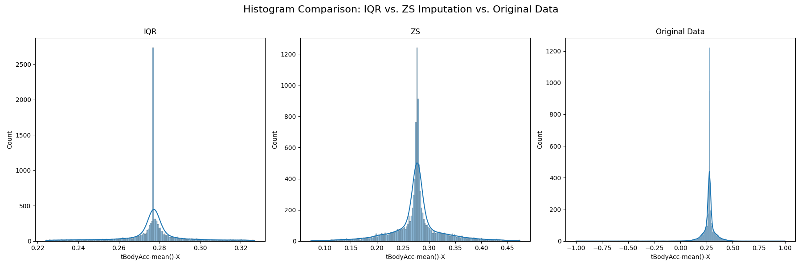
    

    

      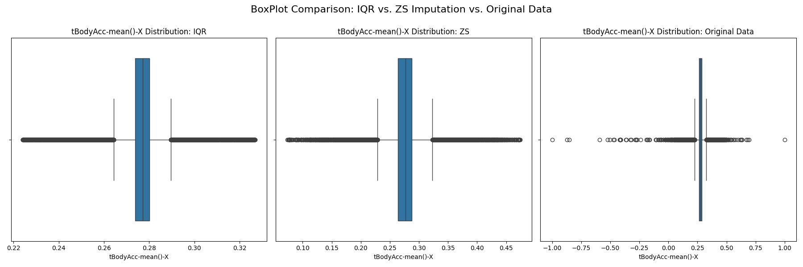
    

    

      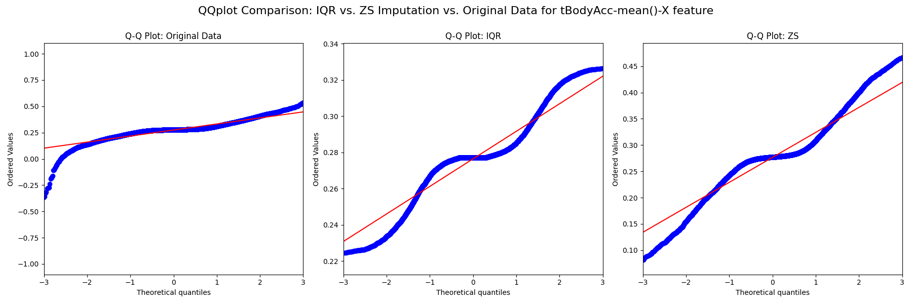
    

    

      The combination of these methods ensures that our data is robust against extreme values, which could distort the clustering process.
    

  </li>
</ol>

<h3>Exploratory Data Analysis (EDA)</h3>

  The Exploratory Data Analysis (EDA) phase provided valuable insights into the characteristics of the dataset, helping to understand its structure and complexity. The EDA was performed using the perform_eda function in the eda.py module.

<ol>
  <li>
    

      <b>Subject Distribution:</b> The number of data points for each subject is shown in the following bar plot.
    

    

      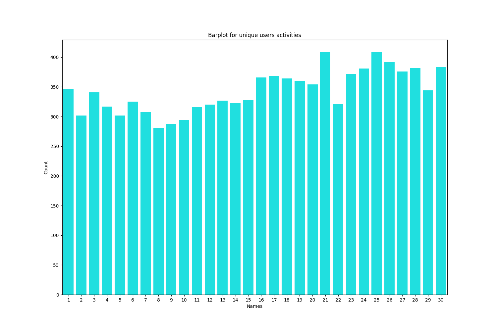
    

    

      This plot, generated by seaborn.barplot, visualizes the distribution of unique users and their contributions to the dataset. It provides a clear view of how many samples each subject contributes to the dataset. The counts were first sorted in ascending order to better visualize the range of data points per subject. This is important to understand the balance in the dataset.
    

  </li>
  <li>
    

      <b>Activity Distribution:</b> The following plot illustrates the distribution of activities across different subjects, using seaborn.countplot.
    

    

      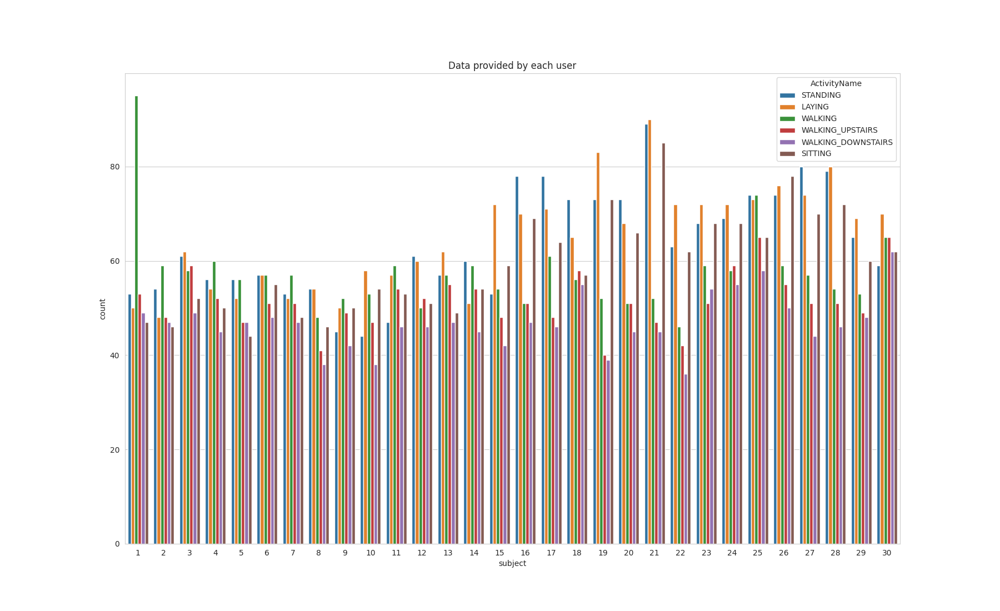
    

    

      This plot helps in understanding the data distribution per activity per subject. It is used to understand if the dataset is balanced across different classes, and if there are any subjects that are biased to any specific activity.
    

  </li>
  <li>
    

      <b>Stationary Activity Comparison:</b> The following Kernel Density Estimate (KDE) plot presents a comparison of stationary activities based on the 'tBodyAcc-mean()-X' feature, using seaborn.kdeplot.
    

    

      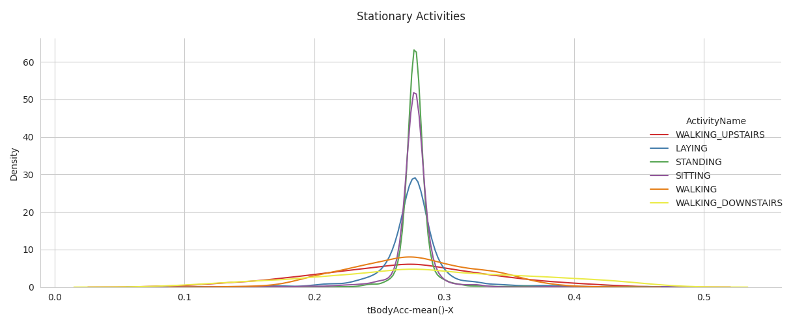
    

    

      This plot allows for a detailed comparison of the distributions of the stationary activities (sitting, standing, and laying), which shows the distribution of these activities in term of 'tBodyAcc-mean()-X' feature.
    

  </li>
</ol>

<h3>Feature Engineering</h3>

  The Feature Engineering stage involves preparing the data for subsequent modeling by applying scaling and dimensionality reduction techniques. These techniques are crucial for ensuring optimal performance in machine learning models.

<ol>
  <li>
    

      <b>Feature Scaling:</b> The features are scaled using StandardScaler from scikit-learn in the feature_scaling function of the feature_engineering.py module. This standardization process ensures that each feature contributes equally to the model and prevents features with larger scales from dominating those with smaller scales. The scaling process centers each feature around its mean, and scales them to unit variance.
    

  </li>
  <li>
    

      <b>UMAP Embedding:</b>
    

    <ul>
      <li>
        

          <b>2D Density Plot of Raw Features:</b> The following interactive plot shows the 2D density of the raw features embedded by UMAP. UMAP is a manifold learning technique that reduces the dimensionality of data while retaining its local structure. The plot reveals well-separated clusters, indicating that UMAP effectively captures the underlying data structure before scaling. The density map highlights the areas where data points are concentrated and the clusters formed by the UMAP embedding. The plot is generated using Plotly's create_2d_density.
        

        

          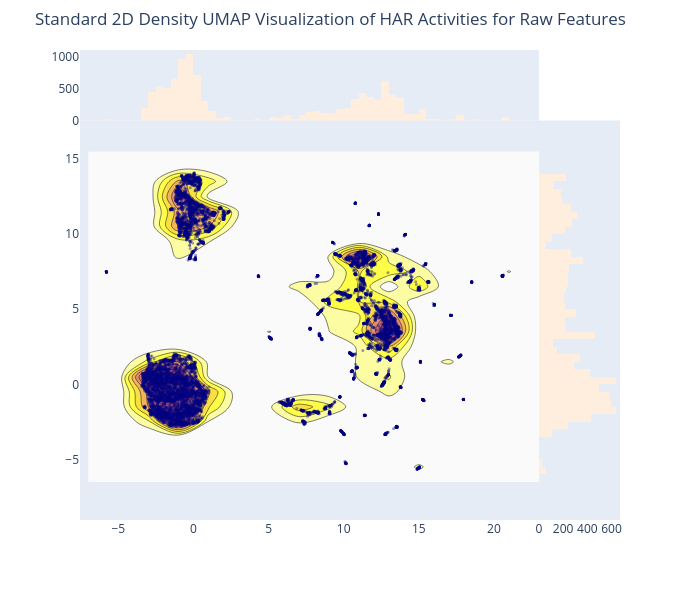
        

      </li>
      <li>
        

          <b>2D Density Plot of Scaled Features:</b> This plot, also generated using Plotly, shows the 2D density of the scaled features embedded by UMAP. It demonstrates the impact of scaling on the resulting structure, showing the resulting clusters after feature scaling. The clusters here are similarly well-separated and it is observable how it has a clear impact on the distribution of the clusters.
        

        

          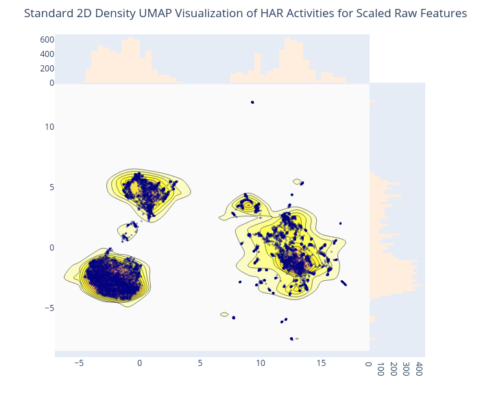
        

      </li>
      <li>
        

          <b>2D Scatter Plot of Raw Features:</b> The following plot displays a scatter plot of the 2D UMAP embedding, colored by activity classes. This visualization uses plotly.express.scatter and helps to confirm if the clustering seen in the density plots corresponds to the actual classes present in the dataset. It clearly shows how the clusters correlate to the class of data points, with some classes like 'WALKING_UPSTAIRS' and 'WALKING_DOWNSTAIRS' appearing more intertwined than others.
        

        

          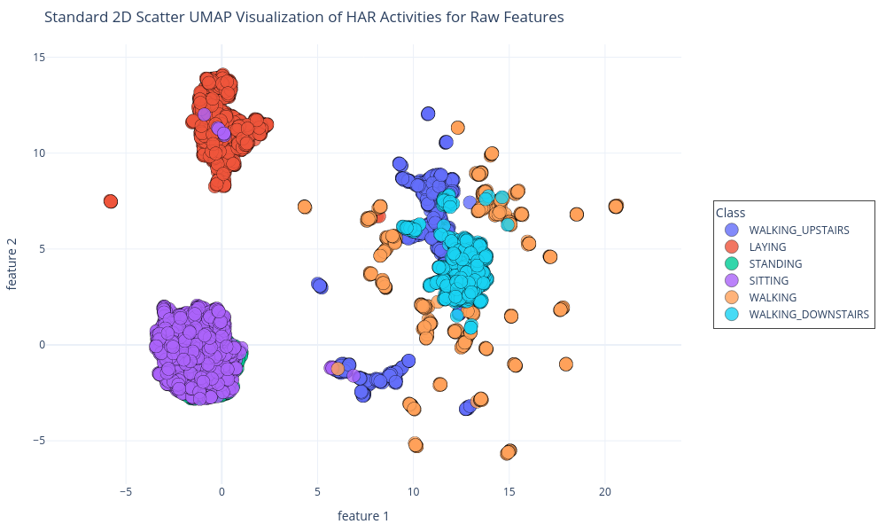
        

      </li>
    </ul>
  </li>
  <li>
    

      <b>PCA for Dimensionality Reduction:</b>
    

    <ul>
      <li>
        

          <b>Variance Ratio Plot:</b> The following plot shows the explained variance ratio by principal component for scaled PCA-transformed features. This plot, generated using matplotlib.pyplot, depicts the cumulative and individual explained variance ratios for each principal component. The dashed vertical line shows the optimal number of components that explain at least 95% of the dataset variance.
        

        

          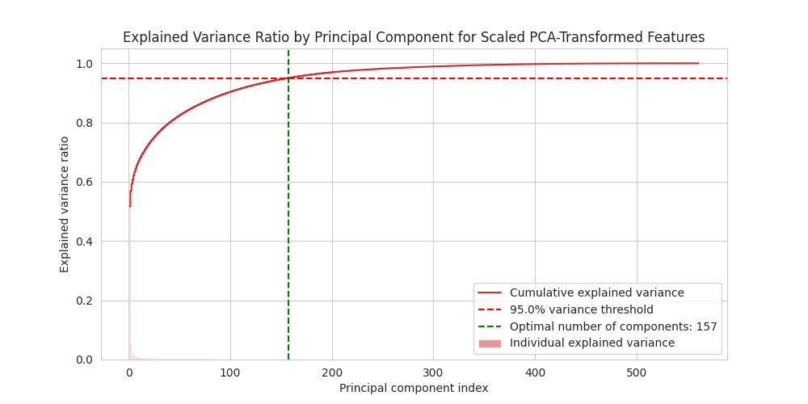
        

        

          The plot helps in determining the optimal number of components to retain when using PCA, balancing dimensionality reduction with information retention. In this case, 157 principal components are enough to retain 95% of the data variance. The optimal number of components is calculated using the apply_optimal_pca in the feature_engineering.py.
        

      </li>
    </ul>
  </li>
</ol>

<h3>Modeling and Evaluation</h3>

  The Modeling and Evaluation section details the application of Gaussian Mixture Models (GMM) for clustering the data and their evaluation. This stage involves assessing the GMM's performance on dimensionally reduced datasets.

<ol>
  <li>
    

      <b>Determining the Number of Clusters:</b> The optimal number of clusters is determined by evaluating the Bayesian Information Criterion (BIC) and the Akaike Information Criterion (AIC) across various numbers of clusters. The criteria_values function in clustering.py calculates both the BIC and AIC values for the different number of clusters. The plot_criteria_values function is then used to generate a plot for the results. The following plots shows these criteria for the scaled PCA-transformed features and for scaled UMAP-embedded features providing guidance on selecting an appropriate number of clusters for GMM.
    

    

      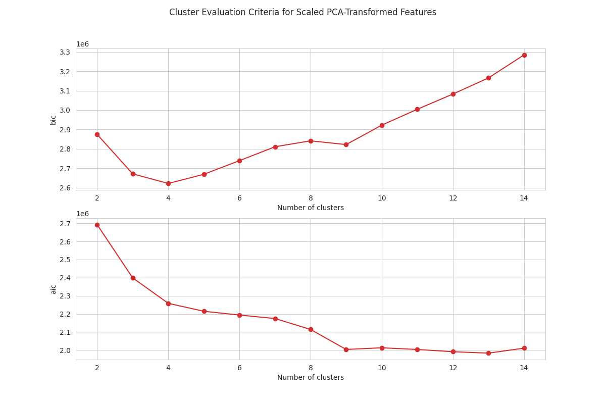
    

    

      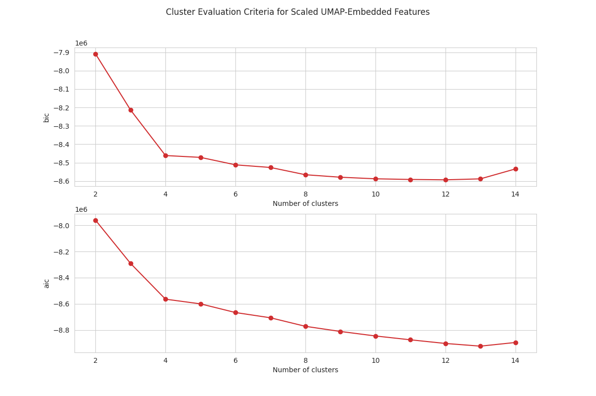
    

    

      The plots demonstrates that both the BIC and AIC values decrease sharply up to four clusters, with the rate of decrease slowing down after this point. This indicates that 
      using four components for the GMM is an adequate number for this data. The optimal number of components is selected by looking for the "elbow" point in the curve.
    

  </li>
  <li>
    

      <b>GMM Clustering:</b>
    

    <ul>
      <li>
        

          <b>Clustering on PCA-Transformed Features:</b> The data transformed by PCA is used in GMM clustering, using the perform_gmm_clustering function, and the resulting assignments are shown on this interactive plot. Each cluster is visualized using the 2D UMAP representation of the data to see how the clusters group based on UMAP space and their labels. The plot_2d_scatter function is used to generate the visualization, colored by GMM cluster assignments and labeled with activity classes, and markers are also assigned based on the classes.
        

        

          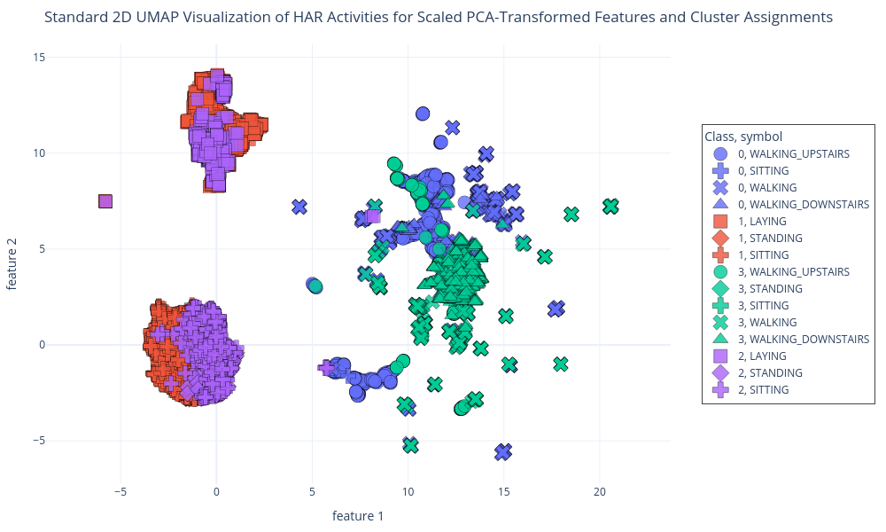
        

        

          This visualization helps to see how the GMM algorithm is grouping data points on a dimensionally reduced space, and how the clusters correlate with activity labels. The plot shows how the data is grouped into 4 clusters by the GMM, and also how the clusters relates to the activity labels.
        

      </li>
      <li>
        

          <b>Clustering on UMAP-Embedded Features:</b> The data transformed by UMAP is used in GMM clustering, and the resulting assignments are shown on this interactive plot. Each cluster is visualized using the 2D UMAP representation of the data to see how the clusters group based on UMAP space and their labels. The plot is generated using the plot_2d_scatter, with colors representing clusters assigned by the GMM.
        

        

          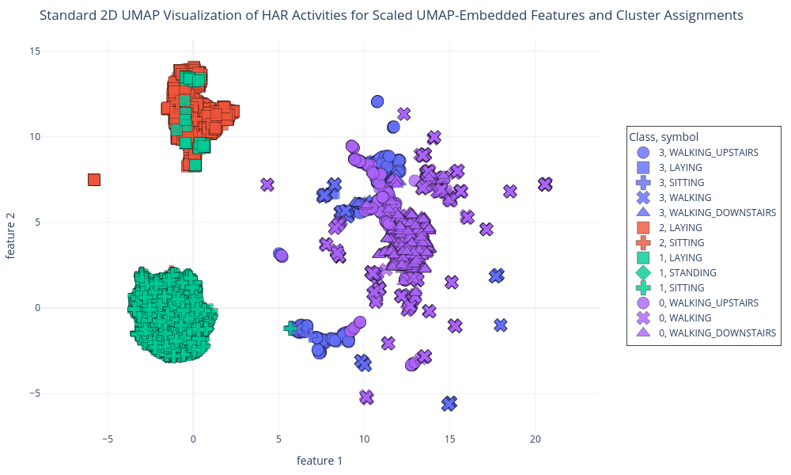
        

        

          This visualization helps to see how the GMM algorithm is grouping data points on a dimensionally reduced space, and how the clusters correlate with activity labels. The plot also shows how the data is grouped into 4 clusters by the GMM and also how the clusters relate to the activity labels. and
        

      </li>
    </ul>
  </li>
</ol>

<h3 id="conclusion" >Conclusion</h3>

  This project has shown the effectiveness of Gaussian Mixture Models (GMMs) for clustering human activity data from the UCI HAR dataset, while emphasizing the positive impact of dimensionality reduction techniques like PCA and UMAP. By exploring these methods, the project has provided a foundation for further research into the application of GMMs for activity recognition. This study also demonstrates the value of dimensionality reduction in enhancing model performance and computational efficiency, and also in visualizing the results of GMM clustering with the help of UMAP.

For more detailed information on installation, running the project, and additional insights, please refer to the 
<a href="README.md"> README </a> file.

<!-- REFERENCES -->
<h2 id="references" style="border-bottom: 2px solid #ddd; padding-bottom: 10px;"> :books: References</h2>

<ol>
  <li>Zhao, Y., Shrivastava, A., & Tsui, K. Regularized Gaussian Mixture Model for High-Dimensional Clustering. IEEE Transactions on Cybernetics. 2019; 49. https://doi.org/10.1109/TCYB.2018.2846404</li>
  <li>Popović, B., Janev, M., Krstanović, L., Simić, N., & Delić, V. Measure of Similarity between GMMs Based on Geometry-Aware Dimensionality Reduction. Mathematics. 2022 https://doi.org/10.3390/math11010175</li>
  <li>San-Segundo-Hernández, R., Córdoba, R., Ferreiros, J., & D’Haro, L. Frequency features and GMM-UBM approach for gait-based person identification using smartphone inertial signals. Pattern Recognit. Lett.. 2016; 73. https://doi.org/10.1016/j.patrec.2016.01.008</li>
  <li>Chen, Y., Wu, X., Li, T., Cheng, J., Ou, Y., & Xu, M. Dimensionality reduction of data sequences for human activity recognition. Neurocomputing. 2016; 210. https://doi.org/10.1016/j.neucom.2015.11.126</li>
</ol>

</body>
</html>
